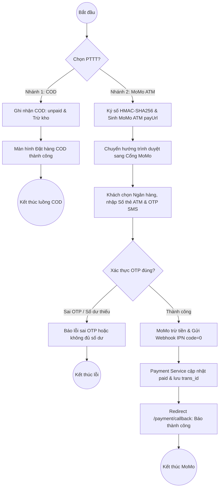

# 📊 HỆ THỐNG SƠ ĐỒ HOẠT ĐỘNG (ACTIVITY DIAGRAMS) - STRIKER FOOTBALL STORE

> **Kiến trúc:** Microservices phân tán (Laravel Core + React 19 + MySQL + GHN + MoMo ATM Napas)  
> **Giao diện chuẩn:** Nền vàng kem (`#FEFECE`), Viền & Mũi tên đỏ mận (`#A80036`), Nút bo tròn kiểu PlantUML Classic Rose  
> **Tổng cộng:** 16 sơ đồ chuẩn hóa (Luồng Người dùng + Phân hệ Admin)

---

## 📂 Danh mục File Sơ đồ

* **File Master Draw.io (Chứa toàn bộ các Tab sơ đồ):**
  * [`docs/striker_activity_diagrams.drawio`](file:///c:/xampp/htdocs/PROJECT-main/PROJECT-main/docs/striker_activity_diagrams.drawio)
* **Thư mục chứa các file Draw.io XML riêng lẻ:**
  * [`docs/drawio_xml/`](file:///c:/xampp/htdocs/PROJECT-main/PROJECT-main/docs/drawio_xml)
* **Thư mục chứa các file mã nguồn PlantUML:**
  * [`docs/plantuml/`](file:///c:/xampp/htdocs/PROJECT-main/PROJECT-main/docs/plantuml)

---

## 👤 PHẦN 1: CÁC LUỒNG DỮ LIỆU CỐT LÕI PHÍA NGƯỜI DÙNG (USER FLOWS)

### 1. [User Flow 1] Đăng ký tài khoản mới
* **File Draw.io XML:** [`docs/drawio_xml/So_do_01_User_Register.xml`](file:///c:/xampp/htdocs/PROJECT-main/PROJECT-main/docs/drawio_xml/So_do_01_User_Register.xml)
* **File PlantUML:** [`docs/plantuml/01_User_Register.puml`](file:///c:/xampp/htdocs/PROJECT-main/PROJECT-main/docs/plantuml/01_User_Register.puml)
* **Các làn (4 Swimlanes):** `Khách hàng` | `Giao diện` | `Hệ thống xử lý` | `Cơ sở dữ liệu`
* **Mô tả:** Nhập thông tin cá nhân $\rightarrow$ Kiểm tra trùng lặp Email/SĐT $\rightarrow$ Mã hóa Bcrypt $\rightarrow$ Lưu `users (status: active)` $\rightarrow$ Chuyển sang trang Đăng nhập.

---

### 2. [User Flow 2] Đăng nhập & Xác thực JWT
* **File Draw.io XML:** [`docs/drawio_xml/So_do_02_User_Login_JWT.xml`](file:///c:/xampp/htdocs/PROJECT-main/PROJECT-main/docs/drawio_xml/So_do_02_User_Login_JWT.xml)
* **File PlantUML:** [`docs/plantuml/02_User_Login_JWT.puml`](file:///c:/xampp/htdocs/PROJECT-main/PROJECT-main/docs/plantuml/02_User_Login_JWT.puml)
* **Các làn (4 Swimlanes):** `Khách hàng` | `Giao diện` | `Hệ thống xử lý` | `Cơ sở dữ liệu`
* **Mô tả:** Nhập Email & Mật khẩu $\rightarrow$ So khớp Bcrypt $\rightarrow$ Cấp JWT Token $\rightarrow$ Lưu Token vào `LocalStorage` & gán Header Authorization.

---

### 3. [User Flow 3] Khám phá sản phẩm & Quản lý giỏ hàng
* **File Draw.io XML:** [`docs/drawio_xml/So_do_03_User_Discovery_Cart.xml`](file:///c:/xampp/htdocs/PROJECT-main/PROJECT-main/docs/drawio_xml/So_do_03_User_Discovery_Cart.xml)
* **File PlantUML:** [`docs/plantuml/03_User_Discovery_Cart.puml`](file:///c:/xampp/htdocs/PROJECT-main/PROJECT-main/docs/plantuml/03_User_Discovery_Cart.puml)
* **Các làn (4 Swimlanes):** `Khách hàng` | `Giao diện` | `Hệ thống xử lý` | `Cơ sở dữ liệu`
* **Mô tả:** Lọc sản phẩm theo danh mục/giá $\rightarrow$ Hiển thị tồn kho biến thể SKU $\rightarrow$ Thêm vào giỏ $\rightarrow$ `order-service` kiểm tra tồn kho khả dụng.

---

### 4. [User Flow 4] Đặt hàng, Tính phí vận chuyển GHN & Áp dụng Voucher
* **File Draw.io XML:** [`docs/drawio_xml/So_do_04_User_Checkout_GHN_Voucher.xml`](file:///c:/xampp/htdocs/PROJECT-main/PROJECT-main/docs/drawio_xml/So_do_04_User_Checkout_GHN_Voucher.xml)
* **File PlantUML:** [`docs/plantuml/04_User_Checkout_GHN_Voucher.puml`](file:///c:/xampp/htdocs/PROJECT-main/PROJECT-main/docs/plantuml/04_User_Checkout_GHN_Voucher.puml)
* **Các làn (4 Swimlanes):** `Khách hàng` | `Giao diện` | `Hệ thống xử lý` | `GHN API & CSDL`
* **Mô tả:** Chọn địa chỉ (Tỉnh/Huyện/Xã) $\rightarrow$ Gọi API GHN tính cước ship $\rightarrow$ Kiểm tra Voucher $\rightarrow$ Tạo đơn hàng `status = 'pending'`.

---

### 5. [User Flow 5] Xử lý Thanh toán (Tổng hợp 2 nhánh COD & MoMo Thẻ ATM)
* **File Draw.io XML:** [`docs/drawio_xml/So_do_05_User_Payment_COD_MoMo.xml`](file:///c:/xampp/htdocs/PROJECT-main/PROJECT-main/docs/drawio_xml/So_do_05_User_Payment_COD_MoMo.xml)
* **File PlantUML:** [`docs/plantuml/05_User_Payment_COD_MoMo.puml`](file:///c:/xampp/htdocs/PROJECT-main/PROJECT-main/docs/plantuml/05_User_Payment_COD_MoMo.puml)
* **Các làn (4 Swimlanes):** `Khách hàng` | `Giao diện` | `Payment Service` | `Cổng MoMo & CSDL`
* **Mô tả:**
  * **Nhánh 1 - Tiền mặt COD:** Ghi nhận `unpaid` $\rightarrow$ Chờ shipper thu tiền mặt $\rightarrow$ Đặt hàng thành công.
  * **Nhánh 2 - MoMo Thẻ ATM nội địa (Napas):** Ký số HMAC-SHA256 $\rightarrow$ Tạo `payUrl` Cổng MoMo ATM $\rightarrow$ Chuyển hướng sang Cổng MoMo $\rightarrow$ Khách chọn Ngân hàng, nhập Số thẻ ATM & OTP SMS $\rightarrow$ MoMo trừ tiền & bắn Webhook IPN (`resultCode=0`) $\rightarrow$ Payment Service cập nhật `paid` $\rightarrow$ Callback báo thành công.

### 5a. [User Flow 5a] Thanh toán Tiền mặt khi nhận hàng (COD Standalone Flow)
* **File Draw.io XML:** [`docs/drawio_xml/So_do_05a_User_Payment_COD.xml`](file:///c:/xampp/htdocs/PROJECT-main/PROJECT-main/docs/drawio_xml/So_do_05a_User_Payment_COD.xml)
* **File PlantUML:** [`docs/plantuml/05a_User_Payment_COD.puml`](file:///c:/xampp/htdocs/PROJECT-main/PROJECT-main/docs/plantuml/05a_User_Payment_COD.puml)

### 5b. [User Flow 5b] Thanh toán Trực tuyến MoMo qua Thẻ ATM nội địa Napas (MoMo ATM Standalone Flow)
* **File Draw.io XML:** [`docs/drawio_xml/So_do_05b_User_Payment_MoMo_ATM.xml`](file:///c:/xampp/htdocs/PROJECT-main/PROJECT-main/docs/drawio_xml/So_do_05b_User_Payment_MoMo_ATM.xml)
* **File PlantUML:** [`docs/plantuml/05b_User_Payment_MoMo_ATM.puml`](file:///c:/xampp/htdocs/PROJECT-main/PROJECT-main/docs/plantuml/05b_User_Payment_MoMo_ATM.puml)

---

### 6. [User Flow 6] Vòng đời sau mua (Theo dõi GHN, Hủy đơn & Đánh giá)
* **File Draw.io XML:** [`docs/drawio_xml/So_do_06_User_PostPurchase_Tracking_Review.xml`](file:///c:/xampp/htdocs/PROJECT-main/PROJECT-main/docs/drawio_xml/So_do_06_User_PostPurchase_Tracking_Review.xml)
* **File PlantUML:** [`docs/plantuml/06_User_PostPurchase_Tracking_Review.puml`](file:///c:/xampp/htdocs/PROJECT-main/PROJECT-main/docs/plantuml/06_User_PostPurchase_Tracking_Review.puml)
* **Các làn (4 Swimlanes):** `Khách hàng` | `Giao diện` | `Hệ thống xử lý` | `GHN API & CSDL`
* **Mô tả:** Tra cứu hành trình bưu tá GHN $\rightarrow$ Hủy đơn khi còn pending $\rightarrow$ Đánh giá sao & bình luận sau khi nhận hàng.

---

## 🏛️ PHẦN 2: 8 PHÂN HỆ QUẢN TRỊ PHÍA ADMIN

### 7. [Admin 1] Quản lý Danh mục & Thương hiệu (Categories & Brands)
* **File Draw.io XML:** [`docs/drawio_xml/So_do_07_Admin_Category_Brand.xml`](file:///c:/xampp/htdocs/PROJECT-main/PROJECT-main/docs/drawio_xml/So_do_07_Admin_Category_Brand.xml)
* **File PlantUML:** [`docs/plantuml/07_Admin_Category_Brand.puml`](file:///c:/xampp/htdocs/PROJECT-main/PROJECT-main/docs/plantuml/07_Admin_Category_Brand.puml)
* **Mô tả:** Tạo mới danh mục/hãng sản xuất $\rightarrow$ kiểm tra trùng lặp slug $\rightarrow$ cập nhật cây danh mục $\rightarrow$ lưu database.

### 8. [Admin 2] Quản lý Sản phẩm & Biến thể SKUs (Products & Variants)
* **File Draw.io XML:** [`docs/drawio_xml/So_do_08_Admin_Product_SKU.xml`](file:///c:/xampp/htdocs/PROJECT-main/PROJECT-main/docs/drawio_xml/So_do_08_Admin_Product_SKU.xml)
* **File PlantUML:** [`docs/plantuml/08_Admin_Product_SKU.puml`](file:///c:/xampp/htdocs/PROJECT-main/PROJECT-main/docs/plantuml/08_Admin_Product_SKU.puml)
* **Mô tả:** Thêm mới/Sửa thông tin sản phẩm, upload ảnh gallery, tạo ma trận biến thể Size/Color, quản lý số lượng tồn kho từng SKU, giá bán.

### 9. [Admin 3] Quản trị Khách hàng & Phân quyền tài khoản
* **File Draw.io XML:** [`docs/drawio_xml/So_do_09_Admin_Customer_Management.xml`](file:///c:/xampp/htdocs/PROJECT-main/PROJECT-main/docs/drawio_xml/So_do_09_Admin_Customer_Management.xml)
* **File PlantUML:** [`docs/plantuml/09_Admin_Customer_Management.puml`](file:///c:/xampp/htdocs/PROJECT-main/PROJECT-main/docs/plantuml/09_Admin_Customer_Management.puml)
* **Mô tả:** Xem danh sách tài khoản, phân quyền Role, thực hiện Khóa tài khoản (Ban) & thu hồi Token.

### 10. [Admin 4] Quản trị Voucher & Khuyến mãi
* **File Draw.io XML:** [`docs/drawio_xml/So_do_10_Admin_Voucher_Management.xml`](file:///c:/xampp/htdocs/PROJECT-main/PROJECT-main/docs/drawio_xml/So_do_10_Admin_Voucher_Management.xml)
* **File PlantUML:** [`docs/plantuml/10_Admin_Voucher_Management.puml`](file:///c:/xampp/htdocs/PROJECT-main/PROJECT-main/docs/plantuml/10_Admin_Voucher_Management.puml)
* **Mô tả:** Tạo mã giảm giá, thiết lập % discount, số tiền tối đa, điều kiện đơn tối thiểu và hạn mức sử dụng.

### 11. [Admin 5] Quản trị Banner & Cài đặt giao diện
* **File Draw.io XML:** [`docs/drawio_xml/So_do_11_Admin_Banner_Settings.xml`](file:///c:/xampp/htdocs/PROJECT-main/PROJECT-main/docs/drawio_xml/So_do_11_Admin_Banner_Settings.xml)
* **File PlantUML:** [`docs/plantuml/11_Admin_Banner_Settings.puml`](file:///c:/xampp/htdocs/PROJECT-main/PROJECT-main/docs/plantuml/11_Admin_Banner_Settings.puml)
* **Mô tả:** Quản lý hình ảnh Slider quảng cáo trang chủ, thứ tự hiển thị và link điều hướng.

### 12. [Admin 6] Quản trị Đơn hàng & Đẩy vận đơn GHN 1-Click
* **File Draw.io XML:** [`docs/drawio_xml/So_do_12_Admin_Order_GHN_1Click.xml`](file:///c:/xampp/htdocs/PROJECT-main/PROJECT-main/docs/drawio_xml/So_do_12_Admin_Order_GHN_1Click.xml)
* **File PlantUML:** [`docs/plantuml/12_Admin_Order_GHN_1Click.puml`](file:///c:/xampp/htdocs/PROJECT-main/PROJECT-main/docs/plantuml/12_Admin_Order_GHN_1Click.puml)
* **Mô tả:** Xem đơn `pending` $\rightarrow$ bấm nút "1-Click GHN" $\rightarrow$ Order Service gọi API GHN tạo vận đơn $\rightarrow$ nhận `tracking_code` và in phiếu giao hàng A5.

### 13. [Admin 7] Báo cáo & Thống kê Doanh thu (Revenue Report)
* **File Draw.io XML:** [`docs/drawio_xml/So_do_13_Admin_Revenue_Report.xml`](file:///c:/xampp/htdocs/PROJECT-main/PROJECT-main/docs/drawio_xml/So_do_13_Admin_Revenue_Report.xml)
* **File PlantUML:** [`docs/plantuml/13_Admin_Revenue_Report.puml`](file:///c:/xampp/htdocs/PROJECT-main/PROJECT-main/docs/plantuml/13_Admin_Revenue_Report.puml)
* **Mô tả:** Lọc thống kê doanh số theo Ngày/Tháng/Năm, phân tích biểu đồ KPI, so sánh cơ cấu doanh thu COD vs MoMo $\rightarrow$ Xuất báo cáo PDF/Excel.

### 14. [Admin 8] Quản lý Tài chính & Xử lý Hoàn tiền MoMo (Finance & Refund)
* **File Draw.io XML:** [`docs/drawio_xml/So_do_14_Admin_Finance_Refund.xml`](file:///c:/xampp/htdocs/PROJECT-main/PROJECT-main/docs/drawio_xml/So_do_14_Admin_Finance_Refund.xml)
* **File PlantUML:** [`docs/plantuml/14_Admin_Finance_Refund.puml`](file:///c:/xampp/htdocs/PROJECT-main/PROJECT-main/docs/plantuml/14_Admin_Finance_Refund.puml)
* **Mô tả:** Xem danh sách đơn hủy/hoàn tiền $\rightarrow$ Admin duyệt $\rightarrow$ `payment-service` ký số HMAC-SHA256 gọi API MoMo Refund $\rightarrow$ Tiền hoàn tự động về tài khoản khách $\rightarrow$ Ghi sổ `financial_logs`.
